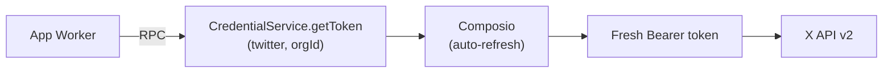

# OpenPost: The Open-Source Buffer & Hypefury Alternative

[](https://app.clawnify.com/deploy?repo=clawnify/OpenPost)

A social media post scheduler with a calendar view, multi-channel composer, queue management, and analytics. Built with **Preact + Tailwind CSS + Hono + D1**. Deploys to Cloudflare Workers via [Clawnify](https://clawnify.com).

Think of it as an open-source alternative to **Buffer**, **Hypefury**, **Typefully**, or **Twitter Hunter** -- a complete content scheduling system you can self-host and customize.

## Features

- **Multi-channel composer** -- write once, publish to multiple platforms with per-platform character limits
- **Calendar view** -- month grid showing scheduled posts with platform color dots
- **Queue management** -- chronological list of scheduled posts with one-click publish
- **Drafts** -- save unfinished posts and come back to them later
- **Channel management** -- add your social media accounts with platform detection and color coding
- **Labels** -- categorize posts with colored labels for organization
- **Media attachments** -- attach several images to a post and every platform publishes the whole set (carousel, gallery or multi-photo, whichever that platform calls it), or attach one video and it goes out as a video post
- **Analytics** -- bar charts showing posts per channel, per label, and daily activity
- **Dashboard** -- at-a-glance stats, upcoming posts, and recent drafts
- **Native previews** -- see the post as it will look on each selected platform before it goes out
- **Direct publishing** -- publish to X, LinkedIn, Instagram, Facebook Pages, TikTok and Bluesky through the accounts connected in Clawnify
- **Publish once, exactly once** -- a channel that has already gone out is never sent again, so retrying a half-delivered post, editing a post that is already live, or a scheduled delivery arriving twice all do the right thing instead of double-posting
- **URL routing** -- bookmarkable pages (`/compose`, `/calendar`, `/queue`, `/drafts`, `/channels`, `/analytics`)

### Supported Platforms

| Platform | Character Limit | Images | Video | Publishing |
|----------|----------------|--------|-------|------------|
| X / Twitter | 280 | up to 4 | -- | text, or a post with up to four images |
| LinkedIn | 3,000 | up to 20 | -- | text, or a post with up to twenty images |
| Instagram | 2,200 | 1-10 | -- | photo + caption; two or more images publish as a carousel (Business or Creator account, picked up from the connection) |
| Facebook | 63,206 | no stated cap | yes | text, one photo, one feed post with several photos, or a video, as a Page you manage |
| TikTok | 2,200 | 1-35 | yes | photo post (the first image is the cover), or a video post |
| Bluesky | 300 | up to 4 | -- | text, with images and link cards |
| Mastodon | 500 | -- | -- | coming soon |
| Threads | 500 | -- | -- | coming soon |

A post carries either images or one video, never both -- no platform here takes a mix.

Attaching more images than a platform accepts, or a video to a channel with no video
column above, fails **that channel only**, with the reason on the post, rather than
quietly publishing a subset or publishing the text on its own -- the other channels in
the fan-out still go out. The composer warns you before you get there.

Connect each account once in Clawnify (Settings → Integrations), then add it as a channel here. Facebook channels are Pages: the channel form lists the Pages the connected account manages so you can pick one.

## Quickstart

```bash
git clone https://github.com/clawnify/OpenPost.git
cd open-post
pnpm install
```

Start the dev server:

```bash
pnpm dev
```

Open `http://localhost:5173` in your browser. The database schema is applied automatically on startup.

### Tests

```bash
pnpm test
```

Runs the real API against an in-memory SQLite database, in process -- no dev
server and nothing to deploy. Covers the publishing rules above by counting the
calls the app actually makes to each platform. Needs Node 22.5+ (for
`node:sqlite`).

### Publishing

Publishing runs through the accounts connected in Clawnify -- no API keys in the app. Locally there is no credential service, so posts save and schedule but publishing reports each channel as not connected.

Each channel on a post is delivered and tracked on its own: one platform rejecting
the content marks that channel failed, with the reason, while the rest still go
out. The post then reads `partial`, and **Retry** sends only the channels that
did not make it -- a published channel is never posted to twice, whether the
retry comes from you, from an edit, or from a scheduled delivery that arrives
more than once. There is no undo on a live post, so this is enforced in the
database rather than left to the caller.

## Tech Stack

| Layer | Technology |
|-------|-----------|
| **Frontend** | Preact, TypeScript, Tailwind CSS v4, Vite |
| **Backend** | Hono (Cloudflare Worker) |
| **Database** | D1 (SQLite at the edge) |
| **Icons** | Lucide |
| **Credentials** | Clawnify credential service binding (Composio OAuth) |

### Prerequisites

- Node.js 20+
- pnpm

## Architecture

```
src/
  shared/
    platforms.ts    -- Platform limits, colours, labels; which platforms take video, and the media rules the server enforces and the composer warns on
    media.ts        -- What an attachment is (image or video) and how its type is decided
  server/
    index.ts        -- Hono API with D1 + credentials middleware
    db.ts           -- D1-native database adapter
    credentials.ts  -- Credential service binding adapter (prod + local fallback)
    twitter.ts      -- X API v2 client (OAuth 2.0 Bearer + OAuth 1.0a)
    schema.sql      -- Database schema (channels, posts, labels, media)
  client/
    app.tsx              -- Root component with router
    context.tsx          -- Preact context for app state
    hooks/
      use-app.ts         -- State management + CRUD operations
      use-router.ts      -- pushState URL router
    components/
      sidebar.tsx        -- Navigation sidebar
      dashboard.tsx      -- Stats cards + upcoming posts
      post-composer.tsx  -- Multi-channel post editor with char limits
      calendar-view.tsx  -- Month grid calendar
      queue-view.tsx     -- Scheduled posts queue
      drafts-view.tsx    -- Draft posts list
      channel-list.tsx   -- Channel management
      analytics-view.tsx -- Bar charts and daily activity
      post-card.tsx      -- Reusable post preview card
      error-banner.tsx   -- Error display
test/
  harness.mjs              -- Boots the real API over an in-memory SQLite database
  publish-idempotency.mjs  -- Publishing is safe to run twice
```

### API Endpoints

| Method | Endpoint | Description |
|--------|----------|-------------|
| GET | `/api/channels` | List channels |
| POST | `/api/channels` | Create channel |
| PUT | `/api/channels/:id` | Update channel |
| DELETE | `/api/channels/:id` | Delete channel |
| POST | `/api/channels/:id/sync-profile` | Re-pull the channel's platform profile |
| GET | `/api/platforms/facebook/pages` | Pages the connected Facebook account manages (for the channel form) |
| GET | `/api/labels` | List labels |
| POST | `/api/labels` | Create label |
| PUT | `/api/labels/:id` | Update label |
| DELETE | `/api/labels/:id` | Delete label |
| GET | `/api/posts` | List posts (filterable by status, channel, date range) |
| GET | `/api/posts/:id` | Get post with channels, labels, media |
| POST | `/api/posts` | Create post |
| PUT | `/api/posts/:id` | Update post |
| DELETE | `/api/posts/:id` | Delete post |
| GET | `/api/posts/calendar?month=YYYY-MM` | Posts grouped by day for calendar |
| POST | `/api/posts/:id/publish` | Publish post to assigned channels |
| GET | `/api/stats` | Dashboard stats + per-channel/label breakdowns |

### Credential Service Binding

In production, the app uses Cloudflare Service Bindings to fetch fresh OAuth tokens from Clawnify's central credential Worker -- zero network hop, no secrets stored on the app.



See [credentials-service-binding.md](https://github.com/clawnify/clawnify/blob/main/docs/credentials-service-binding.md) for the full architecture.

## Deploy

```bash
npx clawnify deploy
```

## License

MIT
